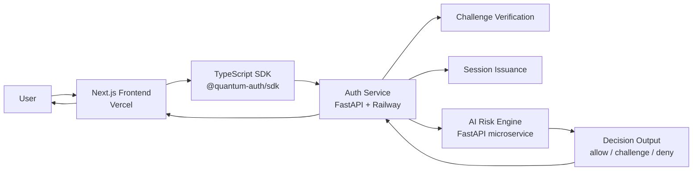

# QuantumAuth SDK
> Passwordless identity infrastructure with AI-native risk decisions and a future-ready security roadmap.

QuantumAuth SDK is a full-stack hackathon project built like a real security startup: a polished frontend, a developer-friendly TypeScript SDK, a FastAPI auth service, and an independent AI risk engine that scores every login attempt in real time.

It is designed for a simple idea with massive upside: make authentication invisible for legitimate users, adaptive under pressure, and ready for the next era of security.

## 🚀 Live Demo

| Surface | URL |
| --- | --- |
| Frontend | `<< [FRONTEND_URL](https://quantum-auth-sdk-web.vercel.app/) >>` |
| Auth API | `<< [AUTH_API_URL ](https://auth-service-production-b5b5.up.railway.app/)>>` |
| AI Risk Engine API | `<< [AI_API_URL](https://ai-risk-engine-production.up.railway.app/) >>` |

**Demo narrative:** register a user, request a challenge, verify the response, score risk, and mint a session token in one end-to-end flow.

## ⚠️ The Problem

Passwords are still one of the weakest layers in modern software.

- Reused credentials make account takeover easier.
- Phishing-resistant UX is still not the default on most apps.
- Static MFA adds friction without understanding actual risk.
- Most teams cannot afford to build adaptive authentication infrastructure from scratch.

The result is a bad tradeoff: either security feels outdated, or user experience becomes painful.

## 💡 The Solution

QuantumAuth replaces passwords with a challenge-response flow and adds an AI-driven risk layer on top of authentication.

Instead of treating every successful login the same, the platform evaluates risk in real time and decides what should happen next:

- `allow` for low-risk attempts
- `challenge` for suspicious but recoverable activity
- `deny` for high-risk behavior

This creates a smarter access pipeline that is:

- Passwordless by default
- Adaptive by design
- Developer-friendly to integrate
- Architected for passkeys, hardware-backed keys, and post-quantum upgrades over time

## ✨ Key Features

### Product Features

- **Passwordless authentication:** no password storage, no traditional password reset surface.
- **Adaptive risk decisions:** every login is evaluated, not just verified.
- **Session-based access:** successful logins return a session token for app access.
- **Developer-first integration:** a TypeScript SDK makes adoption fast for product teams.
- **Demo-ready UX:** clean frontend experience for judges, users, and technical reviewers.

### Technical Features

- **Challenge-response auth flow** implemented with FastAPI endpoints.
- **Dedicated AI risk microservice** separated from the auth service for clean scaling.
- **Monorepo architecture** with `pnpm` workspaces and Turbo.
- **TypeScript SDK package** for reusable client integration.
- **Production-style deployment model** with Vercel for frontend and Railway for backend services.

## 🏗️ System Architecture



## 🔐 Authentication Flow

1. A user registers a public key with the auth service.
2. The auth service creates a unique `userId` and stores the registration record.
3. During login, the frontend requests a one-time challenge for that user.
4. The SDK handles the verification request flow and submits the challenge response.
5. The auth service validates the challenge and signature.
6. The auth service sends the login event to the AI risk engine.
7. The AI risk engine returns a `riskScore` and a policy outcome.
8. Low-risk requests receive a session token immediately.
9. Elevated-risk requests can be routed into a challenge step as the platform evolves.
10. High-risk requests are denied before session creation.

**MVP note:** the current demo uses a simplified signing abstraction for reliability and speed, while the architecture is intentionally shaped to support WebAuthn, passkeys, hardware-backed credentials, and quantum-safe cryptographic primitives in future versions.

## 🧠 AI Risk Engine

The AI Risk Engine is what turns QuantumAuth from a login demo into an adaptive security product.

It does not just ask, "Was the credential valid?" It asks, "Should this login be trusted right now?"

### What it does today

- Runs as an independent FastAPI microservice
- Tracks recent authentication attempt patterns
- Produces a `riskScore` for every verification request
- Maps that score to `allow`, `challenge`, or `deny`
- Supports demo-safe behavior and stricter blocking mode for presentations

### Why it matters

- **Better user experience:** normal users should not be punished with unnecessary friction.
- **Better security posture:** suspicious activity should trigger adaptive controls, not static rules.
- **Better product leverage:** teams get a programmable trust layer instead of bolting on generic MFA.

| Decision | Meaning |
| --- | --- |
| `allow` | Login is low risk and can proceed immediately |
| `challenge` | Activity looks unusual and can trigger step-up verification |
| `deny` | Risk is high enough to block access before a session is created |

## 💻 SDK Usage Example

```ts
import QuantumAuthClient from "@quantum-auth/sdk";

const client = new QuantumAuthClient({
  baseUrl: process.env.NEXT_PUBLIC_API_URL!,
});

async function passwordlessLogin() {
  const { userId } = await client.register("demo-public-key");
  const { challenge } = await client.getChallenge(userId);
  const { token, riskScore } = await client.verify(userId, challenge);

  return { userId, challenge, token, riskScore };
}
```

The SDK abstracts the auth flow into a few clean calls, making it easy for developers to adopt without reimplementing verification logic on every app.

## 🧰 Tech Stack

| Layer | Stack | Purpose |
| --- | --- | --- |
| Frontend | Next.js, React, Tailwind CSS | Product UI and live demo experience |
| Auth Service | FastAPI, Python, Uvicorn | Registration, challenge issuance, verification, sessions |
| AI Risk Engine | FastAPI, Python | Risk scoring and policy decisioning |
| SDK | TypeScript | Developer integration layer |
| Monorepo Tooling | `pnpm` Workspaces, Turbo | Shared development workflow |
| Deployment | Vercel, Railway | Production-style cloud hosting |

## 💼 Business Potential

QuantumAuth sits at the intersection of three valuable markets: identity infrastructure, developer tools, and AI-native cybersecurity.


## 🔭 Future Scope

- Native WebAuthn and passkey support
- Hardware-backed key storage and device trust signals
- Quantum-safe cryptographic adapters as standards mature
- Richer anomaly detection using device, velocity, and behavioral signals
- Step-up verification workflows for risky sessions
- Admin dashboard for policies, observability, and audit trails
- Multi-tenant SaaS platform for B2B customers
- Mobile and backend SDKs beyond TypeScript

## ⚙️ Local Setup

### Prerequisites

- Node.js
- `pnpm`
- Python 3.11+

### 1. Clone and install workspace dependencies

```bash
git clone <your-repo-url>
cd quantum-auth-sdk
pnpm install
```

### 2. Install backend dependencies

```bash
cd services/auth-service
pip install -r requirements.txt

cd ../ai-risk-engine
pip install -r requirements.txt
```

### 3. Start the AI Risk Engine

```bash
cd services/ai-risk-engine
uvicorn main:app --reload --host 127.0.0.1 --port 8001
```

### 4. Start the Auth Service

```bash
cd services/auth-service
AI_RISK_ENGINE_URL=http://127.0.0.1:8001 uvicorn main:app --reload --host 127.0.0.1 --port 8000
```

### 5. Start the Frontend

```bash
cd apps/web
NEXT_PUBLIC_API_URL=http://127.0.0.1:8000 pnpm dev
```

### Optional demo mode flags

```bash
QUANTUMAUTH_DEMO_MODE=true
QUANTUMAUTH_DEMO_ALLOW_BLOCKING=false
```

Open the frontend, register a public key, trigger a challenge, verify the login, and inspect the returned risk score and session token.

## 🌍 Why This Project Matters

Digital identity is overdue for a reset.

Users deserve authentication that feels frictionless. Businesses need defense against phishing, credential reuse, and account takeover. Developers need something they can integrate fast without stitching together multiple security products.

QuantumAuth matters because it pushes all three goals forward at once:

- better UX through passwordless login
- better security through adaptive decisioning
- better adoption through a clean developer SDK

This project shows how authentication can become a trust layer, not just a login screen.


## Closing Statement

QuantumAuth SDK is a strong prototype of what next-generation authentication should look like: passwordless for users, intelligent for security teams, and simple for developers to ship.

I'm not just building a better login flow. I'm building the trust infrastructure for the next wave of software.
